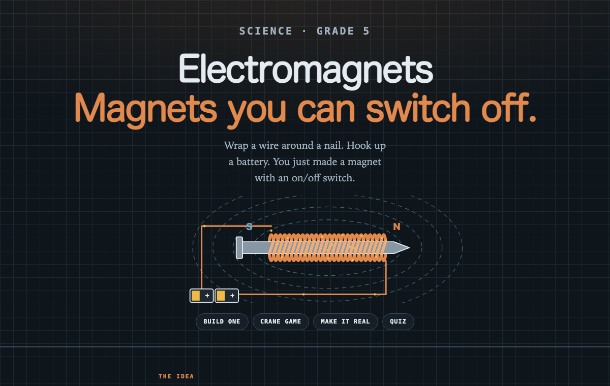
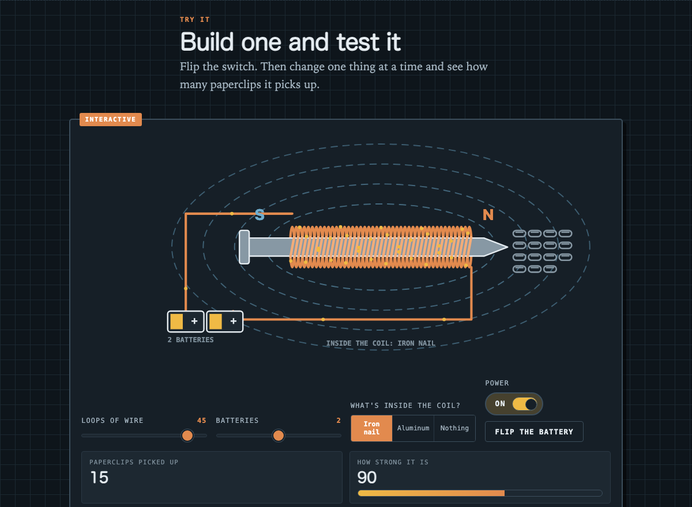

# Electromagnets

An interactive, one-page science site that teaches 5th graders how electromagnets work — the kind of magnet you can switch off.

**→ [firefoxway.github.io/electromagnets](https://firefoxway.github.io/electromagnets/)**



## What's in it

Six sections, each one setting up the next.

| Section | What you actually do |
| --- | --- |
| **What is an electromagnet?** | Read five short paragraphs. A fridge magnet is stuck being a magnet; this one has a switch. |
| **Build one and test it** | Drag sliders for loops of wire, number of batteries, and what's inside the coil. Flip the power on and count the paperclips that jump up. |
| **The junkyard crane** | Play a game — magnet **on** to grab scrap, slide to the truck, magnet **off** to drop it. Load all six. |
| **Where they're hiding** | Six real uses: doorbell, speakers, motors, MRI, maglev trains, junkyard cranes. |
| **Make a real one** | Four materials, six steps, and a safety box, for building one with a nail and a D battery. |
| **Quick quiz** | Five questions. You get an explanation whether you're right or wrong. |



## The science — and where it's simplified

The lab bench runs on one line of arithmetic:

```
strength = loops of wire × batteries × core factor
```

Core factors are `1.0` for the iron nail, `0.055` for aluminum, and `0.045` for an empty coil. Paperclips lifted is `strength ÷ 6.2`, rounded.

That's a deliberate simplification of the real relationship (field strength scales with the number of turns and the current, multiplied by how magnetically permeable the core is). It's tuned so five ideas come across clearly:

- More loops of wire → stronger magnet
- More batteries → more current → stronger magnet
- **Only a magnetic core helps.** Aluminum is a metal and conducts electricity beautifully, but it's not magnetic — this is the misconception most worth breaking, so aluminum and an empty coil score almost identically.
- Reversing the battery swaps the N and S ends without changing the strength
- No electricity, no magnet at all

What it deliberately leaves out: magnetic saturation, wire resistance and heating, the length of the coil, and the fact that a real field weakens with distance. The heat does get a mention in the text, because that part matters if you actually build one.

## Running it locally

One file, no dependencies, no build step:

```bash
open index.html
```

Or serve it over HTTP if you prefer:

```bash
python3 -m http.server 8000
```

## How it's built

- **A single HTML file, about 48 KB.** No framework, no `package.json`, nothing fetched from a CDN — not even the fonts. It works with the Wi-Fi off.
- **Canvas 2D** draws the electromagnet: the coil, the dashed field lines, the current dots travelling the circuit, and the paperclips hanging off the nail are all redrawn per frame. The crane game is plain DOM with CSS transitions.
- **Animation is gated on `IntersectionObserver`.** A canvas doesn't draw while it's off screen, and the loop shuts off completely once nothing is moving — so leaving the tab open costs nothing.
- **Light and dark themes** are defined as CSS custom properties. The canvas reads its colors from those same properties and re-reads them when the theme changes, so the drawings theme correctly too.
- **Accessibility:** honors `prefers-reduced-motion`, has visible keyboard focus, and the lab bench reports its readings to screen readers through an `aria-live` region.

Type is all system fonts: a rounded sans for headings (friendly for 10-year-olds), an old-style serif for body text, and monospace for labels and readouts.

## Editing it

Everything is in `index.html`:

| What you'd want to change | Where to look |
| --- | --- |
| Colors | the `:root` custom properties near the top of `<style>` — light theme first, dark theme just below |
| How strong the magnet gets | the `CORES` table and `strength()` in the **BENCH** block |
| Quiz questions and explanations | the `Q` array in the **QUIZ** block |
| Crane game difficulty | `TOTAL` (pieces) and `TRUCK` (the drop zone) in the **CRANE GAME** block |

The JavaScript is split into commented blocks — `HERO`, `BENCH`, `CRANE GAME`, `QUIZ` — each one self-contained.

## Deploying

Served by GitHub Pages from `main` at the repo root. Push and it's live in about a minute:

```bash
git add -A && git commit -m "Update" && git push
```
